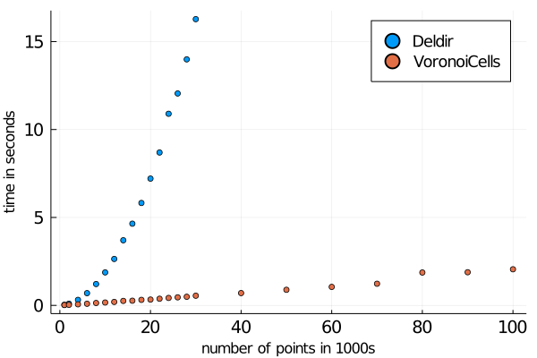

# Deldir

[](https://github.com/robertdj/Deldir.jl/actions)
[](https://codecov.io/github/robertdj/Deldir.jl?branch=master)

[deldir](https://cran.r-project.org/package=deldir) is an R package for computing Delaunay triangulations and Voronoi/Dirichlet tesselations.
This Julia package wraps the Fortran code from deldir.


## Installation

Switch to `Pkg` mode in Julia with `]` and run

```julia
add Deldir
```


## Usage

The coordinates of the generators are specified as two vectors that are fed to `deldir`, the main function of this package:
```julia
x = rand(8)
y = rand(8)
del, vor, summ = deldir(x, y)
```

The output from `deldir` are three [DataFrames](https://github.com/JuliaData/DataFrames.jl):
One for the topology of the Delaunay triangulation; one for topology of the Voronoi tesselation; one with a summary mainly related to the area of the triangles and Voronoi cells.

By default, `deldir` works with points in the unit rectangle, but other bounding rectangles can be specified as a third argument.

The area of the Voronoi cells are also available directly with the function `voronoiarea`.

Two functions are available to extract the edges of the Delaunay triangles and Voronoi cells in a "plot friendly" manner:
```julia
Dx, Dy = edges(del)
Vx, Vy = edges(vor)
```

Using the results from above this can be plotted using e.g. the [Plots package](https://github.com/tbreloff/Plots.jl):

```julia
using Plots
scatter(x, y, xlim = (0,1), ylim = (0,1), markersize = 6, label = "generators")
plot!(Dx, Dy, label = "Delaunay")
plot!(Vx, Vy, style = :dash, label = "Voronoi")
```

One realization looks like the following.


# Details

There are other Julia package for interacting with Voronoi cells and Delaunay triangulations.
The deldir R package has been around for a long time and therefore it is my hope that the Fortran code give correct results.
Furthermore, deldir has two qualities I value:

- It interacts well with the bounding box.
- It returns the area of the Voronoi cells *in the same order as the input generators*.

I am also the author of the pure Julia package [VoronoiCells](https://github.com/JuliaGeometry/VoronoiCells.jl) with similar functionalities.
The *VoronoiCells* package executes *much* faster.
Consider the time taken to run the `voronoiarea` functions of both packages with an increasing number of points:



The script generating this output is available in the `examples` folder.
The comparison plot is made with
```julia
julia> versioninfo()
Julia Version 1.5.0
Commit 96786e22cc (2020-08-01 23:44 UTC)
Platform Info:
  OS: Linux (x86_64-pc-linux-gnu)
  CPU: Intel(R) Core(TM) i5-8265U CPU @ 1.60GHz
  WORD_SIZE: 64
  LIBM: libopenlibm
  LLVM: libLLVM-9.0.1 (ORCJIT, skylake)

(@v1.5) pkg> status
Status `~/.julia/environments/v1.5/Project.toml`
  [64db5801] Deldir v1.3.1
  [e3e34ffb] VoronoiCells v0.2.0
```


## Compiled code

To make it easier to install *Deldir* the Fortran code is cross-compiled using the [BinaryBuilder package](https://github.com/JuliaPackaging/BinaryBuilder.jl) and hosted in the [Julia Packaging organization](https://github.com/JuliaPackaging/Yggdrasil/tree/master/D/Deldir).

I am not using the latest version of the Fortran code, because there is a tighter coupling with R from version 0.1-16 and onwards.
In particular, the use of the subroutines `fexit` and `rexit` from R cause problems even when linking against R's libraries.


## Limitations

Not all features of the R package are available.
I have e.g. chosen to ignore options regarding dummy points. 

Are you missing anything important? 
Check out the [manual](https://cran.r-project.org/web/packages/deldir/deldir.pdf) for the R package to see if the Fortran library supports it.


# Acknowledgement

[Rolf Turner](https://www.stat.auckland.ac.nz/~rolf) is author of the deldir package for R as well as all Fortran code used in this package.

